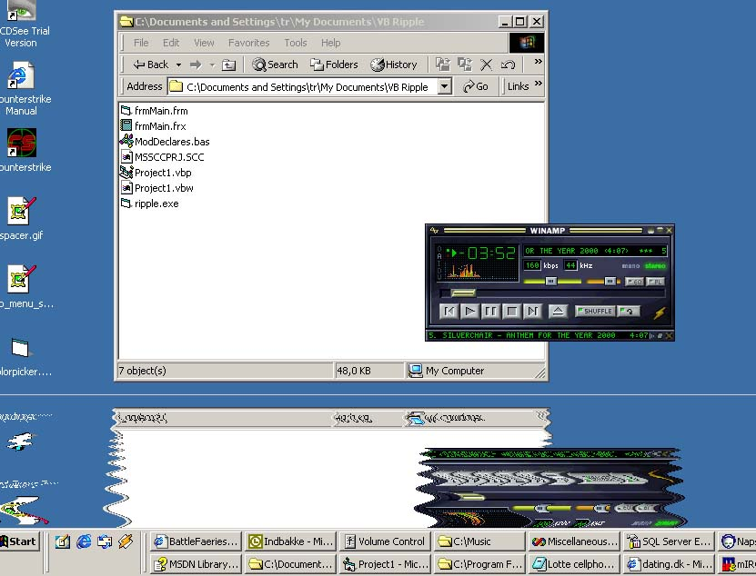



## Ripple

### Description

This is a realtime ripple of the desktop (see screenshot :)) Makes the bottom of your screen reflect the top in a water like effect... looks kinda cool... If you like it, then please vote. Thnx =)
 
### More Info
 
nah..

a ripple effect

uses some system resources

             |
---                |---
**Submitted On**   |2000-11-06 11:04:28
**By**             |[Thomas Raben](https://github.com/Planet-Source-Code/PSCIndex/blob/master/ByAuthor/thomas-raben.md)
**Level**          |Advanced
**User Rating**    |4.9 (73 globes from 15 users)
**Compatibility**  |VB 5\.0, VB 6\.0
**Category**       |[Graphics](https://github.com/Planet-Source-Code/PSCIndex/blob/master/ByCategory/graphics__1-46.md)
**World**          |[Visual Basic](https://github.com/Planet-Source-Code/PSCIndex/blob/master/ByWorld/visual-basic.md)
**Archive File**   |[CODE\_UPLOAD1170311152000\.zip](https://github.com/Planet-Source-Code/thomas-raben-ripple__1-12804/archive/master.zip)

### API Declarations

some...

